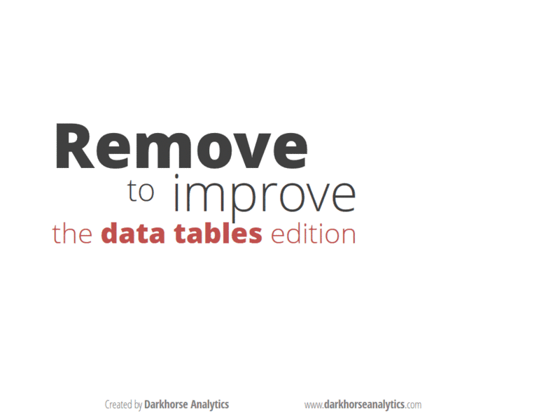

```{r setup, include=FALSE}
knitr::opts_chunk$set(echo=TRUE, eval=FALSE, message=FALSE, error=FALSE, warning=FALSE, comment='')
```

```{r pkg_loads, echo=FALSE, eval=TRUE}
library(tidyverse)
library(bitops)
tips = read_csv('./data/tips.csv')
```

# Before We Dive In

## whoami {.build}

- What's the level below n00b?
- A rose by any other name would still be a data scientist.
- I'm not a sailor, I just cuss a lot.
- Shh... they don't know I'm here.

## ls -lh ./this_talk/goals

1. /r/QuitYourBullshit
2. Explain it like I'm 5
3. ???
4. Profit.

# Dispelling the Propaganda

## ln -s /data_science/definition /machine_learning

<iframe width="560" height="315" src="https://www.youtube.com/embed/hkDD03yeLnU?rel=0&amp;showinfo=0" frameborder="0" allow="autoplay; encrypted-media" allowfullscreen></iframe>

## ln -s /data_science/definition /machine_learning {.build}

- She builds a GUI
- In Visual Basic
- From scratch
- To track an IP address
- When she could have used Google

<div class='centered'>

</div>

## unlink /data_science/definition

<div class='centered'>

</div>

## comm -12 data_scientist.txt hacker.txt

- Analytical and curious
- Driven by questions like 'How?', 'Why?', and 'What if?'
- Depending on their daily tasks, they share similarities with blue team and red team
- Create sandboxes, generate their own data, build tools, and understand how software works

# Hacking Like a Data Scientist

## What Does That Mean?

- Thinking fast and iteratively
- Mining through heaps of data
- Looking for patterns and edge cases
- Using visualizations to consume large amounts of data
- Knowing the best format for your data
- Realizing what your data doesn't tell you
- Establishing hypotheses
- Knowing where to look when debugging

## The Workflow

<div class='centered'>

</div>

# Importing Data {.flexbox .vcenter}

## Where Does it Come From?

- Flat files (CSV, TSV, PSV, etc)
- Markup files (XML, HTML)
- Email files (EML, PST)
- Image files (JPEG, PNG, etc)
- Databases (Oracle, SQLServer, MySQL, etc)
- JSON
- APIs
- Webscraping
- Selenium
- Javascript

## Reading in the Data

<h4>Flat files</h4>
```{r flat_files, echo=TRUE, eval=FALSE}
psv = readr::read_delim('~/path/to/some_file.csv', delim='|')
```

<h4>Markup files</h4>
```{r markup_files, echo=TRUE, eval=FALSE}
xml = xml2::read_xml('~/path/to/some_xml.xml')
```

<h4>Image files</h4>
```{r img_files, echo=TRUE, eval=FALSE}
jpeg = jpeg::readJPEG('~/path/to/some_image.jpeg')
```

<h4>JSON</h4>
```{r json_files, echo=TRUE, eval=FALSE}
json = jsonlite::read_json('~/path/to/some_json.json')
```

<h4>Databases</h4>
```{r databases, echo=TRUE, eval=FALSE}
con = DBI::dbConnect(odbc::odbc(), username='user', password='pwd', dsn='dsn')
result = dbGetQuery(con, 'SELECT * FROM users')
```

## Getting the Data

<h4>APIs</h4>
```{r apis, echo=TRUE, eval=FALSE}
# Via a wrapper
tweets = tweetr::search_tweets('#misec', n=10000, include_retweets=FALSE)

# Via a URL
url = 'https://data.detroitmi.gov/api/views/6gdg-y3kf/rows.csv?accessType=DOWNLOAD'
detroit_crime = download.file(url, destfile='crimes.csv')

# Via a POST request
PARAMS = list("__EVENTTARGET"="", "__EVENTARGUMENT"="", "__VIEWSTATE"="2D99E290", 
              "txtboxName"="Dade Murphy", "drpdwnGender"="Male", "txtboxAge"="10")

BASE_URL = "https://mdocweb.state.mi.us/otis2/otis2.aspx"
cmd = paste0('curl -X POST -d "',
             paste(names(PARAMS), PARAMS, sep="=", collapse="&"),
             '" ',
             BASE_URL)
html = read_html(system(cmd, intern=TRUE))
```

## Getting the Data

<h4>Selenium</h4>
```{python webscraping, echo=TRUE, eval=FALSE, python.reticulate=FALSE}
from selenium import webdriver
from selenium.webdriver.common.keys import Keys

driver = webdriver.Firefox()
driver.get('http://www.python.org')
elem = driver.find_element_by_name('q')
elem.send_keys('pycon')
elem.send_keys(Keys.RETURN)
```

<h4>JavaScript</h4>
```{js javascript, echo=TRUE, eval=FALSE}
# Go to https://www.cryptocurrencychart.com/
var a = document.body.appendChild(document.createElement('a'));
a.download = "export.txt";
a.href = "data:text/plain;base64," +
    btoa(JSON.stringify(CryptoCurrencyChart.chart.data()));
a.innerHTML = "download data!";
```

# Tidying Data {.flexbox .vcenter}

## XPath {.build}

<h4>Most Common Operators</h4>
- `nodename`: the name of an element (i.e. `div`)  
- `/`: selects the root node  
- `//`: selects all elements specified afterwards, regardless of where they are  
- `.`: selects the current node  
- `..`: selects the parent of the current node  
- `@`: selects attributes (i.e. `class`)  

<h4>Examples</h4>

- `//div`: grab all `div` elements regardless of where they are  
- `//div/p`: grab all `p` elements that are children of `div` elements  
- `@href`: grab all `href` attributes  
- `//table[@class='movies']`: grab all `table` elements with `class` "movies"  

## CSS Selectors {.build}

<h4>Most Common Operators</h4>
- `nodename`: selects all elements with that name (i.e. `div`)
- `#<name>`: selects the element with the `id` "name"
- `.<name>`: selects all elements with the `class` "name"
- `:`: allows the use of psuedo-selectors
- `>`: only selects elements that are children of the parent node

<h4>Examples</h4>
- `div`: grabs all div elements
- `#article`: grabs all elements with the `id` "article"
- `p.result`: grabs all `p` elements with the `class` "result"
- `ul > li:first-child` grabs the first list item from all lists

## Example: Tidying HTML Data

```{r get_data, echo=TRUE, eval=FALSE}
url = 'https://www.reuters.com/news/technology/'
html = read_html(url)

stories = html %>%
    html_nodes('.FeedItem_item')

links = stories %>%
    html_nodes('h2 > a') %>%
    html_attr('href')

titles = stories %>%
    html_nodes('h2 > a') %>%
    html_text()

ledes = stories %>%
    html_nodes('.FeedItemLede_lede') %>%
    html_text()
```


## Regular Expressions {.build .smaller}

<div style='display:inline;'>
<div style='float: left;'>
<h4>Quantifiers</h4>
- `*`: 0 or more of something
- `?`: 0 or 1 of something
- `+`: 1 or more of something
- `{n,m}`: between `n` and `m` of something

<h4>Character Classes</h4>
- `\w`: word characters
- `\d`: digits
- `\s`: whitespace characters
- `[`: custom character classes

<h4>Positional Characters</h4>
- `^`: start of string
- `$`: end of string
</div>
<div style='float:right;'>
<h4>Lookarounds</h4>
- `?=`: positive look ahead
- `?!`: negative look ahead
- `?<=`: positive look behind
- `?<!`: negative look behind

<h4>Special Characters</h4>
- `-`: creates a range of values
- `?`: can making a quantifier non-greedy
- `^`: negation operator in custom classes
</div>
</div>

## An Example of Using Regex

```{r regex_ex, echo=TRUE, eval=FALSE}
logs = read_lines('./data/auth.log')
date = logs %>%
    str_extract('[AFJDNOS][a-z]{2}\\s+\\d{1,2}')
time = logs %>%
    str_extract('\\d{2}:\\d{2}:\\d{2}')
user = logs %>%
    str_extract('(?<=\\d\\s)[a-z_][\\w\\d_-]+')
process = logs %>%
    str_extract('[a-z-]+(\\[\\d+\\])?(?=:)')
description = logs %>%
    str_extract('(?<=:\\s).+?$')
```

## A Warning About Regex

<div class='centered'>

</div>

## A Final Tidy Example {.flexbox .vcenter}

<div class='centered'>

</div>

# Transforming Data

## Standardization

- Converting strings to lower case or upper case
- Forcing values to be between 0 and 1 (`(x - min(x)) / (max(x) - min(x))`)
- Removing extraneous text from strings 
- Adding text to complete the picture (converting 'st' to 'street')
- Ensuring all indicator variables are binary
- Ensuring all positive outcomes in a binary variable are coded as 1

## Casting to a New Type

- When modeling, it's helpful to change data types
- Often takes the form of 'Male'/'Female' => 0/1
- Can be useful in forcing programs to not guess data types
- With great power comes great misery

## IP Address Example {.smaller}

```{r ip_example, echo=TRUE, eval=TRUE}
ips = data_frame(o1=192, o2=sample(162:175, 1000, replace=TRUE),
                 o3=sample(0:20, 1000, replace=TRUE), o4=sample(105:150, 1000, replace=TRUE)) %>%
    mutate(ip = paste(o1, o2, o3, o4, sep='.')) %>%
    select(ip)

ip2long = function(ip) {
    ips = unlist(strsplit(ip, '.', fixed=TRUE))
    octet = function(x,y) bitOr(bitShiftL(x, 8), y)
    Reduce(octet, as.integer(ips))
}
ips$long = sapply(ips$ip, function(ip) ip2long(ip))
ips = ips %>%
    mutate(in_range = between(long, ip2long('192.168.10.145'), ip2long('192.173.15.109')))
head(ips)
```

## Binning/Categorizing Data

- Involves collapsing data into numerical or categorical groups
- Great for reporting purposes, and also identifying trends

# Visualizing Data

## General Guidelines {.flexbox .vcenter}

<div class='centered'>
<p style='weight:bold;font-size:84px;color:red'>DON'T F**KING USE PIE CHARTS!</p>
</div>

## General Guidelines

- Histograms and bar charts are not the same thing, but serve the same general purpose.
- Bar charts are almost always better as tables.
- Line charts are used to show trends over time.
- Scatterplots should show a relationship between at least two variables.
- Three ways to show attributes: color, shape, and size.
- Keep the colorblind in mind.
- The ink to data ratio should be minimized.
- *Always* label your axes.

## Two Types of Graphs {.build}

<h4>Exploratory Graphs</h4>
- These are graphs done during your exploratory data analysis phase.
- They should be quick and dirty, with no attention paid to how nice they look.
- Main goal is to help you formulate hypotheses, identify outliers, and/or highlight trends and relationships.
- You should be developing more questions than answers with these graphs.

## Example of Exploratory Graphs

```{r tips1, echo=TRUE, eval=TRUE, fig.align='center'}
hist(tips$total_bill)
```

## Example of Exploratory Graphs

```{r tips2, echo=TRUE, eval=TRUE, fig.align='center'}
hist(tips$tip)
```

## Example of Exploratory Graphs

```{r tips3, echo=TRUE, eval=TRUE, fig.align='center'}
plot(tips$total_bill, tips$tip)
```

## Example of Exploratory Graphs

```{r tips4, echo=TRUE, eval=TRUE, fig.align='center'}
ggplot(data=tips, aes(x=total_bill, y=tip)) + geom_point() + 
    facet_wrap('day', nrow=2) + theme(panel.background=element_blank(), 
                                      axis.line=element_line(color='black'))
```

## Example of Exploratory Graphs

```{r tips5_code, echo=TRUE, eval=FALSE}
ggplot(data=tips, aes(x=total_bill, y=tip, size=size, color=time, shape=sex)) +
    geom_point() + ... + theme(legend.position='none')
```

```{r tips5, echo=FALSE, eval=TRUE, fig.align='center'}
ggplot(data=tips, aes(x=total_bill, y=tip, size=size, color=time, shape=sex)) + geom_point() + 
    facet_wrap('day', nrow=2) + theme(panel.background=element_blank(), 
                                      axis.line=element_line(color='black'),
                                      legend.position='none')
```

## Two Types of Graphs

<h4>Communication Graphs</h4>
- These are graphs you develop when you're ready to tell a story.
- They should provide more answers than questions.
- They should be self-contained.
- Rapid7, Bob Rudis's Blog, and VDBR all have good examples

## Less is More

<div class='centered'>

</div>

# Analyzing Data

## Where to Start?

- There are literally a ton of different ways to attack your data.
- And the number of ways will continue to increase as you develop hypotheses.
- All of these ways can essentially be achieved with just a few key concepts

## Group By

```{r groupby, echo=TRUE, eval=TRUE}
# Mean Total Bill: $19.79, Mean Tip: $2.99
tips %>%
    group_by(day) %>%
    summarise(avg_bill = mean(total_bill),
              avg_tip = mean(tip))
```

## Ranking {.smaller}

```{r ranking, echo=TRUE, eval=TRUE}
tips %>%
    group_by(day) %>%
    arrange(desc(total_bill)) %>%
    mutate(rank = row_number()) %>%
    ungroup() %>%
    arrange(day, rank)
```

## Filtering {.smaller}

```{r filtering, echo=TRUE, eval=TRUE}
tips %>%
    group_by(day) %>%
    arrange(desc(total_bill)) %>%
    mutate(rank = row_number()) %>%
    filter(rank <= 3) %>%
    ungroup() %>%
    arrange(day, rank)
```

## Projects in the Works

- A Rat in the Lab!
- How Close is Too Close?
- Where's My Bike, Dude?

# Automate the Cool Stuff

## Everything Should be Automated

- Write scripts for everything.
- Things that you're reporting on semi-frequently should be put in a report.
- Things that you're reporting on much more frequently, or want in real time, should be in a dashboard.

## An Example

<div class='centered'>

</div>

# Let's Tie it All Together

## Using Data Science to Get a CTF Flag

<iframe width="560" height="315" src="https://www.youtube.com/embed/L8sH8VM2Bd0?rel=0&amp;showinfo=0&amp;start=700" frameborder="0" allow="autoplay; encrypted-media" allowfullscreen></iframe>
